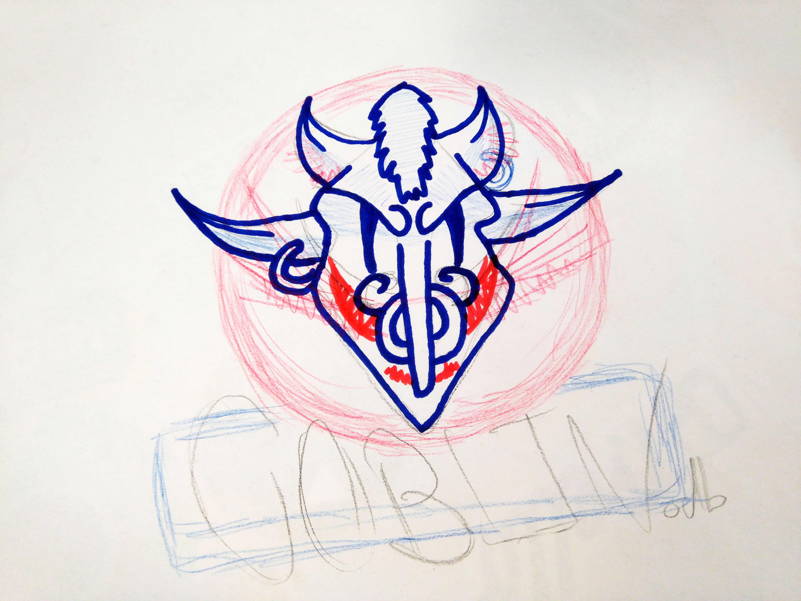

# GoblinDB



### Fear the Goblin!

**An amazing, simple and fun database for humans**


### Goblin Philosophy

- Coding is fun, so databases must be fun too.
- Data is the king.
- Data should be stored in the system as a file when a change happend.
- Data storage in the system must be hackable.
- The database can lead or connect your server components
- Events are great... because we are asynchronous
- We prefer facts over promises: facts are there, promises maybe yes or not. In fact, we're talking about callbacks.


#### Demo
You can run a demo in 4 steps!

1. Clone this repository
```bash
    git clone https://github.com/UlisesGascon/GoblinDB 
```

2. Enter in the folder
```bash
    cd GoblinDB
```

3. Install the dependencies
```bash
    npm install
```

4. Run *fear_the_goblin.js*
```bash
    node fear_the_goblin.js
```

#### Documentation

**Add it to your Node.js project**
- In your terminal...
```bash
    npm install goblindb --save
```
- In your file..
```javascript
    var GDB = require("./goblin");
    var http = require("http");
    
    var goblinDB = GDB();
```

**Reitrieving data**

By default Goblin will create an empty json file as database storage, if the file exist it will added to Goblin.

Just for the example, current database status... as you can see is a JSON file:
- *goblin_bd.json*:
```json
{"hello":"world!","array":["aaaa",true,5],"objectData":{"property": 1}}
```

- *get*. Return the information from a key or the whole database
```javascript
    var GDB = require("./goblin");
    var http = require("http");
    
    var goblinDB = GDB();
    
    console.log(goblinDB.get())
    // {"hello":"world!","array":["aaaa",true,5],"objectData":{"property": 1}}
    
    console.log(goblinDB.get("hello"))
    // {"hello":"world!"}
```

**Saving data**

You have many options to save data. As Goblin is a key/value database you need to know what is the key that you want to use/create. 

You can storage all the data that you want except functions. Until the next release.

- *set(key, data)*. Write or replace data to a defined key (optional)
```javascript
    var GDB = require("./goblin");
    var http = require("http");
    
    var goblinDB = GDB();
    
    // set data in db.admin
    goblinDB.set({"name": "Ulises", "role": "developer"}, "admin");
    
    // set data in root
    goblinDB.set({"hello": "Human...!"});
```

- *push(data)*. Write data in a new key (random name added)
```javascript
    var GDB = require("./goblin");
    var http = require("http");
    
    var goblinDB = GDB();
    
    goblinDB.push({"name": "Ulises", "role": "developer"})
```

- *update(data, key)*. Add and modify data to a defined key 
```javascript
    var GDB = require("./goblin");
    var http = require("http");
    
    var goblinDB = GDB();
    
    goblinDB.update({"name": "CodingCarlos", "friends": ["Ulises", "Jose"]}, "admin");
```

**Fun with Events**
You can use events in order to react to changes in the database. All the events are managed internally by Goblin inside as hooks.

You can specify the trigger event:
- add
- update
- delete
- reconfigure
- change, in any case it will be triggered.

The event will return an object that contains previous data and current data.
At the moment the the listeners can be added to the database root, but in the next release it will possible to focus in on or more specific paths

- *on()*, Add a new function to be triggered on a specific change.
```javascript
var GDB = require("./goblin");
var http = require("http");

var goblinDB = GDB();

goblinDB.on('change', function(changes){
    console.log("cambio:", changes)
    console.log("====================")
});
```

- *off()*, Remove a previous record event
```javascript
var GDB = require("./goblin");
var http = require("http");

var goblinDB = GDB();

goblinDB.on('change', function(changes){
    console.log("cambio:", changes)
    console.log("====================")
});

// more code...

goblinDB.off('change', function(changes){
    console.log("cambio:", changes)
    console.log("====================")
});
```

**Extra features**
Some extra features that maybe can help you.

- *getConfig() & updateConfig*, modify/replace/extend configuration.
```javascript
var GDB = require("./goblin");
var http = require("http");

var goblinDB = GDB();

console.log(goblinDB.getConfig())
// { logPrefix: '[GoblinDB]', file: './goblin_bd.json', recordChanges: true }

goblinDB.updateConfig({ logPrefix: '[GoblinDB-modify]'})

console.log(goblinDB.getConfig())
// { logPrefix: '[GoblinDB-modify]', file: './goblin_bd.json', recordChanges: true }
```

- *stopStorage() & startStorage()*. enable/disable the storage in disk.
```javascript
var GDB = require("./goblin");
var http = require("http");

var goblinDB = GDB();

goblinDB.stopStorage();

// more code that will not touch be stored in the disk...

goblinDB.startStorage(); 
// Now the current GoblinDB will be stored in disk and it will keep doing it
```

### Testing

You can test your changes...

```bash
npm test
```

### Future Implementations

- [ ] Logo, branding...
- [ ] Landing Page.
- [ ] Support multidimensional navigation in the database (.ref() method)
- [ ] Support to chain methods
- [ ] Add basic query methods
- [ ] Add Avance query methods
- [ ] Add support to .once() method for events
- [ ] Add support to UID in events
- [ ] Support .goblin extension for database in order to record raw database with objects, functions...
- [ ] Support .json compatibility for database
- [ ] Additional events to support (config changes, etc...)
- [ ] Add additional support to Backup goblin with other databases like Firebase, Mongo... in real time.
- [ ] Full documentation in JSDoc
- [ ] Gulp Tasks Improves
- [ ] Example Folder

### Achievements

### v.0.0.2

**Main target:**
- Develop the basics key functionalities (methods)
- Key/Value operative database
- Event support
- Database recorded as file
- Minimum config setup

**Features:**
- Added support to JSDoc
- Added Gulp Tasks
- Added Basic Testing with Mocha, Chai and Istanbul
- Added .editorconfig
- Added esLint support
- Roadmap added
- Added File structure
- Added minimal validation
- Added basic documentation
- Added GoblinDB as Module
- Added GoglinDB Helpers as an independente module
- Added support to store the data on demand as JSON
- Added full support to events
- Added support to key changes in events
- Added Method on
- Added Method off
- Added Method getConfig
- Added Method setConfig
- Added Method stopStorage
- Added Method startStorage
- Added Method get
- Added Method push
- Added Method set
- Added Method update


### v.0.0.1

**Features:**

**Notes:**
Just a "Hello world"